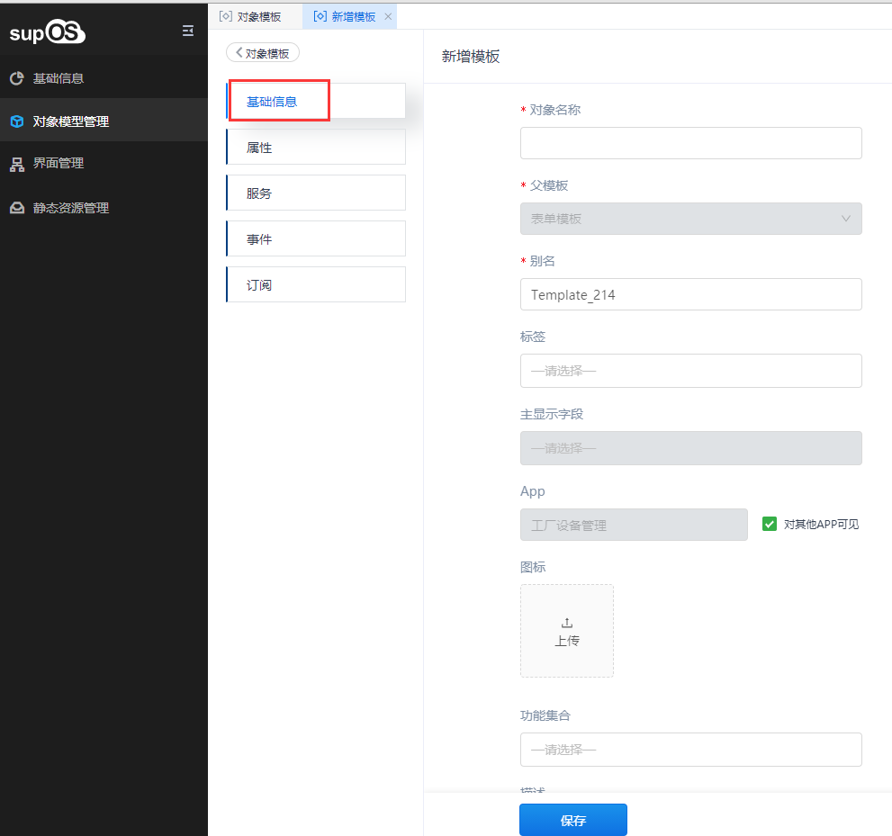
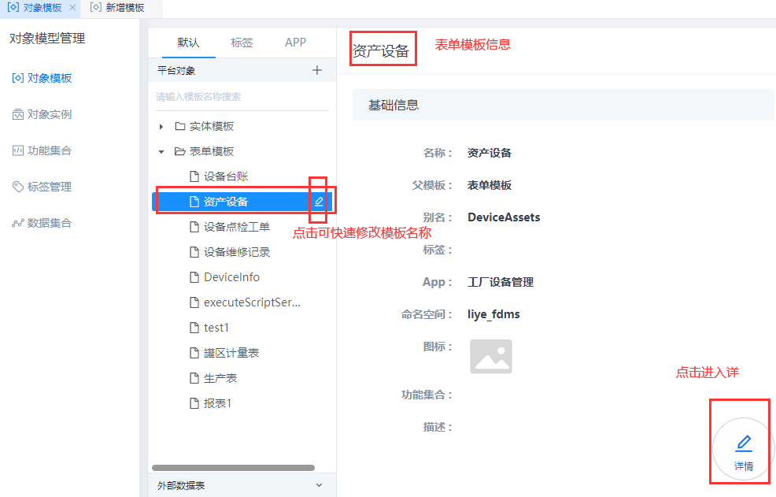
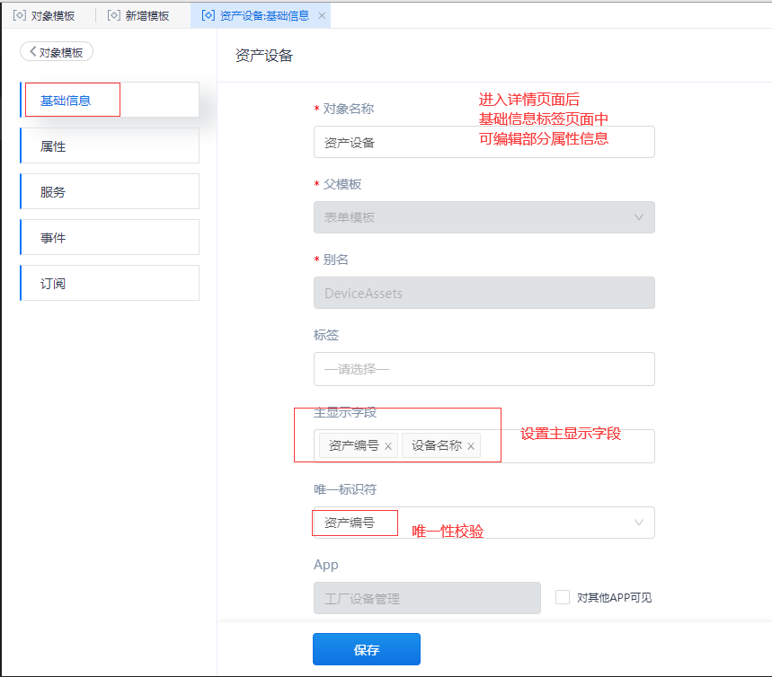

> ## **「设备资产」基础信息**

---

> ### **创建「设备资产」基础信息**

---

- **在「对象模型管理--对象模板」菜单下，选择一个表单模板作为父模板，点击，在该模板下创建一个新的表单对象模板，自动继承父模板；**
- **输入对象模板基础信息；**
  - 「**对象名称**」：必填，用户可自定义修改；
  - 「**父模板**」：自动显示创建模板时选中的父模板，**不可手动修改**；
  - 「**别名**」：必填，用于对象模板唯一标识，别名自动生成，可根据对象模板信息自行修改定义其含义；
  - 「**标签**」：从对象类别的标签中给对象实例添加多个标签，用于标记对象模板方便归类查询，也可在编辑对象模板时添加标签；
  - 「**主显示字段**」：设置该模板的主显示字段，在对象选择器下选中模板时根据主显示字段搜索实例；
    - 「**提示**」：唯一标识符：仅用于表单模板。表单模板创建后，通过编辑表单模板详情选择一个属性作为该表单的唯一标识符。
      
  - 「**APP**」：用于对象模板的分类，如果通过某个APP创建的对象模板，该对象模板会关联相应的工业APP标签。在平台端新建对象模板，该对象模板默认为system；在APP设计器内新建对象模板，该对象模板默认属于该APP；勾选是否对其它APP可见；
  - 「**图标**」：上传图片作为对象实例的图标；
  - 「**功能集合**」：调用系统已增加的功能集合，继承该功能集合的所有属性、服务、事件、订阅等功能；
  - 「**描述**」：用于记录对象的版本更新时修改信息的详细记录，也可用于对象实例的详情描述；

- **点击「保存」按钮，即创建模板完成；**

---

「**注意**」 
在信息创建成功后，将会展示当前表单模板所在的「**命名空间**」，该信息将用户对象的整个生命周期，用于与其他对象的数据隔离与请求标识；

---

  

  

---

> ### **编辑「设备资产」基础**

---

**选中创建成功的「设备资产」表单模板，点击右下角的「详情」按钮进入子页面，选择「基础信息」标签页，进行信息编辑；**

  
