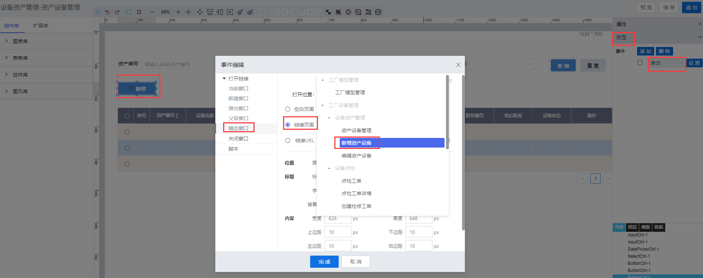
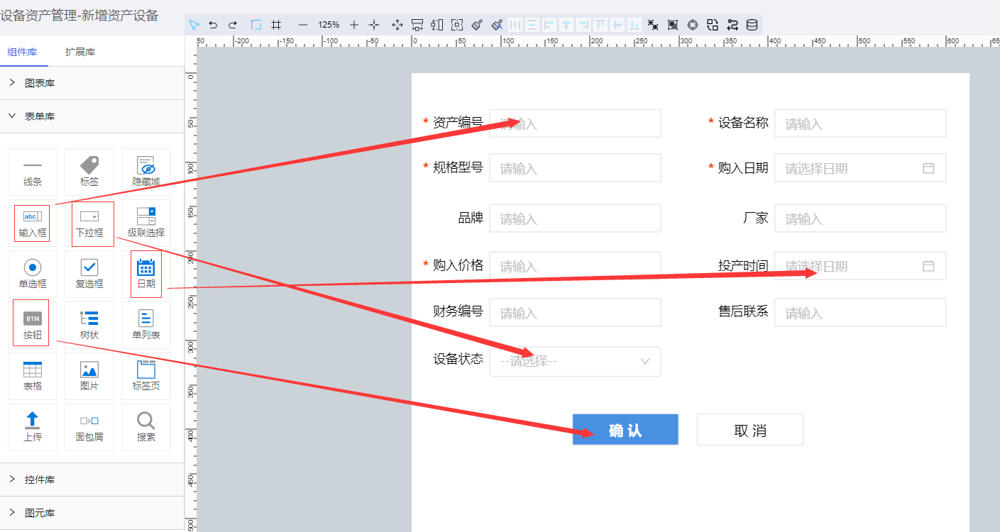
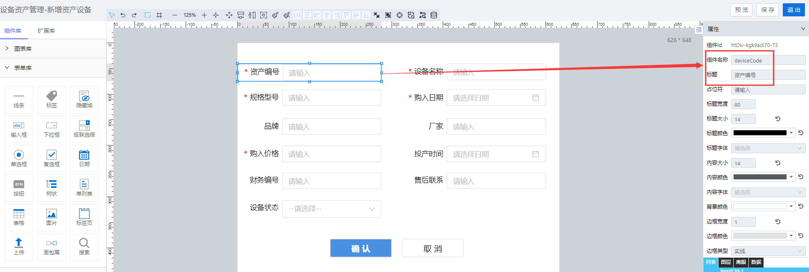
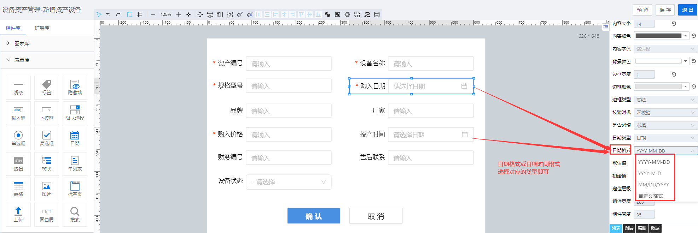
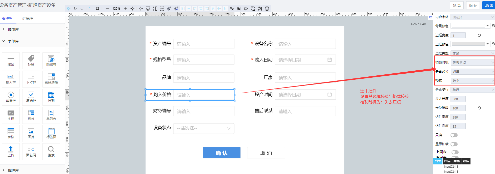
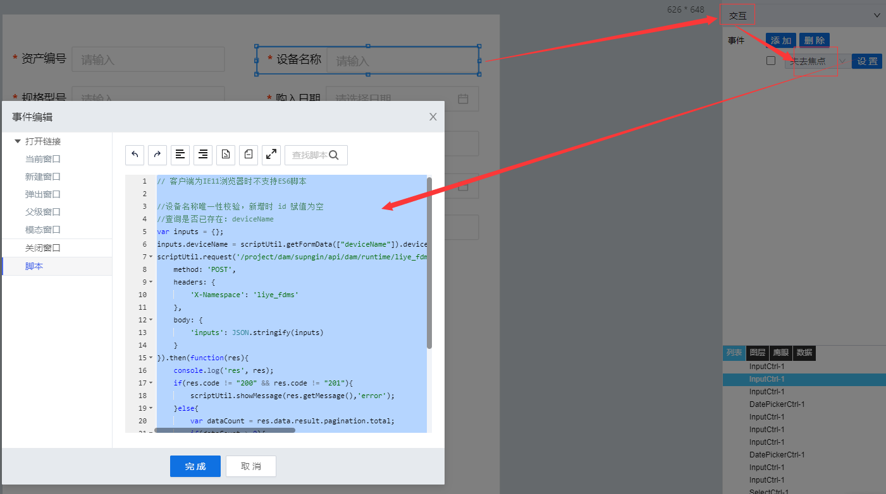

> ## **新增「资产设备管理」**

---

- **创建「新增资产设备」新页面；**
- **在列表页面设置「新增」按钮「单击」事件；**
- **设置其打开「模态窗口」，链接指向新创建的页面；**

---

> ### **页面功能分析**

---

- 信息创建「**确认提交**」；
  - 填写设备资产信息后，提交信息创建；
- 「**内容校验**」：必填性校验与数据格式校验；
  - 提交数据时，对必填性字段及对应格式的数据进行格式校验；
- 「**唯一性校验**」；
  - 提交数据时，调用接口，校验资产编号与设备名称在记录里是唯一的；
- 取消创建「**取消**」；
  - 点击取消按钮，不提交当前信息，且关闭当前模态窗口；

---

> ### **所需控件及关键操作说明**

---

- **主要用到表单库中的：输入框、按钮、下拉框、日期控件；**
- **根据UI设计，将对应的控件拖拽到画布上，可打开网格视角调整对齐格式等样式；**

---

> #### **设置控件名称**

---

- **为每一个控件设置控件别名，方便通过别名获取其属性值；**
  - 「**提示**」：这里控件名称最好与对象模板中的属性字段别名保持一致，不至于在众多控件中找不到对应的属性，也方便后面取值或者设置属性值！

---

> #### **「下拉框」绑定数据源**

---

- **简单的为状态下拉框，配置静态数据源**

---

> #### **「日期控件」显示指定格式数据**

---

- **选中对应的日期控件，点击属性，找到数据类型，选择对应的日期格式数据类型**

---

> #### **「内容校验」必填校验与格式校验**

---

选中需要校验的控件，选择属性设置，必填校验、校验时机、格式校验等；在触发提交表单数据事件时，将进行对应的数据内容校验。

---

> #### **「数据唯一性校验」**

---

当内置的校验已经不满足复杂的逻辑校验时，可以通过交互事件，自定义脚本服务的形式，实现对应的数据逻辑校验。

---

> ### 脚本服务示例

---

**选中相应的控件，点击右侧的「交互」属性，为相应的控件绑定「单击」「数据加载」等事件，将对应的脚本服务代码写入，执行服务。**

- **常用服务参考**
  - [常用脚本服务](/docs/DeviceInfo/ObjectService/commonJS)
  - [内置对象服务](https://supos-project.github.io/supOS-Object-Documents/#/docs/ObjectService/Service/)
- **当前页面使用脚本**
  - [新增数据提交](/docs/DeviceInfo/ObjectService/buttonAdd)
  - [取消数据提交](/docs/DeviceInfo/ObjectService/buttonCancel)
  - [deviceCode唯一性校验](/docs/DeviceInfo/ObjectService/deviceCodeUniq)
  - [deviceName唯一性校验](/docs/DeviceInfo/ObjectService/deviceNameUniq)